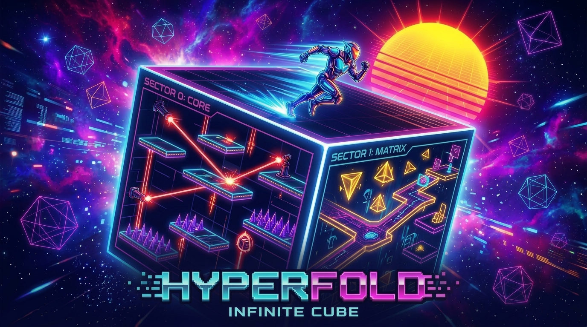

# Hyperfold: Infinite Cube

> Traverse infinite sectors folded across the faces of a rotating 3D hypercube.

The game combines classic 2D jump & run platforming mechanics with a pseudo-3D cube world that tumbles 90° whenever the player crosses any of the four screen edges. While physically appearing as a 3D cube tumbling in deep space, topologically the game world is an **infinite non-Euclidean manifold** featuring fixed, hand-crafted screens that never loop in circles (unless specifically designed) and always preserve round-trip navigation.



---

## 🌟 Key Features

### 🎲 Infinite Non-Euclidean Cube Rebinding Engine
* **Higher-Dimensional Topology**: Rooms exist on an open $(X, Y)$ coordinate manifold. Traversing 6 consecutive screens yields unique sectors without looping back to old screens, while traveling backward deterministically returns to your exact origin.
* **Seamless 3D Tumble Transitions**: When crossing an edge boundary, the cube executes a smooth 90° slerp rotation (`easeInOutCubic`, ~420ms).
* **Zero Pop-In Predictive Pre-Rendering**: The destination face, the incoming trailing face (Face 5: $-Z$), and all perpendicular adjacent faces are dynamically pre-rendered *before* the tumble begins, eliminating texture pop-in or mid-turn replacements.
* **Canvas-to-WebGL Pipeline**: Crisp 2D Canvas tilemaps and dynamic sprites rendered directly onto Three.js `CanvasTexture` materials with dynamic player point lighting.

### 🏃 Precision 2D Platforming Kinematics
* **Fluid Movement**: Smooth acceleration, deceleration, and variable jump height (cutting vertical velocity on early jump release).
* **Coyote Time (100ms)**: Jump gracefully even after walking off a platform edge.
* **Jump Buffering (120ms)**: Queue jumps immediately before touching down on solid ground.
* **Moving Platforms & Passenger Physics**: Floating hover cruisers and vertical elevators that accurately carry players with horizontal momentum inheritance.
* **Down + Jump Drop-Through**: Press `Down + Jump` while standing on one-way or moving platforms to drop through, mirroring classic platformer conventions.
* **Dynamic Laser Barriers & Angled Turrets**: Mobile laser barriers that patrol on harmonic tracks and cycle between idle, telegraph warning, and lethal states; wall/ceiling/floor/pedestal turrets shooting at cardinal or diagonal angles with high-velocity laser bolts and continuous raycast beams that dynamically clip against moving platforms (allowing moving platforms to serve as dynamic shields!).
* **Multi-Directional Spikes**: Hazard spikes mounted on floors, walls, ceilings/roofs, and solid floating platforms with forgiving apex-matched hitboxes and automatic geometric orientation detection.
* **Interactive Elements**: One-way ledges, crumble blocks with respawn timers, super bounce launch pads, and collectible Energy Prisms / Data Chips.

### 💥 Explosive Death & Dual-Action Reset System
* **360° Particle Burst**: On death, the player detonates with 72 high-velocity particles flying in all directions—concentric expanding shockwave rings, tumbling debris shards with aerodynamic drag physics ($0.94^{\Delta t \cdot 60}$), and billowing plasma motes.
* **Sprite Hiding & Materialization**: Player chassis and eyes are hidden during the explosion, reappearing with materialization sparks upon sector respawn.
* **Tap R to Die & Respawn**: Pressing `R` (or clicking `Reset [R]`) triggers an immediate player death sequence and sector respawn.
* **Hold R to Restart Entire Level**: Long-pressing `R` ($\ge 0.8\text{s}$) renders an in-world holographic radial charging ring around the player avatar, converging particle motes, and a live HUD hold percentage banner. Holding to completion resets the entire level back to Genesis Core `[0, 0]`, restores all collected Energy Prisms, resets discovered rooms, snaps 3D cube rotation back to identity, and detonates a dimensional reboot warp effect.

### 🌌 Synthwave Atmosphere & Procedural Audio
* **Cosmic Starfield**: Independent deep-space starfield and drifting wireframe octahedra that remain stationary relative to the camera to accentuate the cube's 3D rotation.
* **Dynamic Particle Systems**: Landing dust, jump bursts, collectible pickup sparks, motion trails, laser impact sparks, charging motes, muzzle flashes, 360° death explosions, expanding shockwaves, and screen-edge boundary luminescence.
* **Zero-Asset Web Audio API Synthesizer**: Fully procedural sound effects—resonant 3D rotation whooshes, synth jump arps, landing thuds, collectible chimes, blaster zaps, impact sizzles, warning telegraph chirps, a 3-layer cyberpunk synth explosion (sub-bass drop + detuned dual sawtooth/square filter sweep + filtered noise burst), an ascending 6-note level reboot fanfare, and a low-pass ambient drone. No external audio files required.

### 🎥 Interactive 3D Camera Controls
* **Free Orbit**: Click and drag with the left mouse button to orbit around the cube from any angle.
* **Zoom**: Scroll the mouse wheel to inspect details up close or view the cosmic void.
* **Camera Reset & Flat Mode**: Hit `V` to reset the camera to the default dramatic angle, or `C` to toggle between 3D Depth View and Orthographic 2D Flat Face View.

### 📊 Real-Time Performance & Telemetry HUD
* **Built-In Profiler**: Real-time FPS graph, average/min/max frame-time tracking, sample ring buffers, and memory telemetry.
* **Toggle Shortcut**: Press `P`, `F3`, or `` ` `` anytime during gameplay to view diagnostic stats.

---

## 🎮 Controls

| Action | Keyboard | Gamepad | Mouse / Touch |
| :--- | :--- | :--- | :--- |
| **Move Left / Right** | `A` / `D` or `←` / `→` | D-Pad / Left Stick | — |
| **Jump** | `Space` / `W` / `↑` | Button `A` / Cross | — |
| **Drop Through Platform** | `S + Space` or `↓ + Jump` | `Down + Button A` | — |
| **Reset Sector / Die (Tap)** | `R` (Tap) | Button `Select` / `Back` (Tap) | `Reset [R]` Button (Tap) |
| **Restart Whole Level (Hold 0.8s)** | `Hold R` | `Hold Select` / `Back` | `Reset [R]` Button (Hold) |
| **Toggle Sound** | `M` | — | HUD Button |
| **Toggle 3D / Flat View** | `C` | — | HUD Button |
| **Reset 3D Camera** | `V` | Button `R3` (Stick Click) | HUD Button |
| **Performance Telemetry** | `P` / `F3` / `` ` `` | — | HUD Button |
| **Orbit 3D Camera** | `I` / `J` / `K` / `L` | Right Thumbstick | Left Click + Drag |
| **Zoom In / Out** | — | — | Mouse Wheel |

---

## 🗺️ Demo Level: 10 Non-Euclidean Sectors

The included demo campaign illustrates the infinite hypercube topology:

* **Sectors $(0,0) \rightarrow (6,0)$**: A continuous 7-screen horizontal voyage exceeding the 6 physical faces of a 3D cube.
* **Sector $(2,1)$ The Spire & $(2,2)$ Starlight Zenith**: Vertical climb chambers testing Up/Down 90° tumble rotations.
* **Sector $(4,-1)$ Sub-Zero Crypt**: Secret subterranean vault accessed by falling through a chasm, containing hidden Energy Prisms and high-power launch pads.
* **Sector $(6,0)$ Prism Horizon**: The Warp Core Goal Portal completing the stage.

---

## 🚀 Getting Started

### Prerequisites
* [Node.js](https://nodejs.org/) (version 18.0 or higher recommended)
* `npm` (bundled with Node.js)

### Installation

```bash
# Clone the repository
git clone https://github.com/vos/hyperfold.git
cd hyperfold

# Install dependencies
npm install
```

### Development Server
Run Vite's local dev server with Hot Module Replacement (HMR):
```bash
npm run dev
```
Open `http://localhost:3000` in your browser.

### Production Build & Preview
Build the TypeScript source and preview the optimized production bundle:
```bash
# Build & preview with one command
npm start

# Or run separately
npm run build
npm run preview
```

### Running Automated Tests
Run the unit test suite powered by Node.js's native test runner:
```bash
npm test
```
Validates floor consistency across all 10 rooms, spawn safety, passenger physics, Down+Jump mechanics, dynamic laser barriers, shooting laser collisions and platform shielding, directional spikes on walls/roofs/platforms, 360° player death explosion with drag physics, tap-to-die & hold-to-restart level mechanics, non-Euclidean navigation invariants, and 3D transition face mappings (52 tests passing across 7 test suites).

---

## 📁 Project Architecture

```
hyperfold/
├── index.html                     # WebGL viewport, HUD overlays, and styling
├── package.json                   # Project metadata and build scripts
├── tsconfig.json                  # Strict TypeScript configuration
├── vite.config.ts                 # Vite bundler configuration
├── screenshot.jpg                 # Gameplay showcase image
├── src/
│   ├── main.ts                    # Game loop, state coordinator, and transition manager
│   ├── engine/
│   │   ├── AudioManager.ts        # Procedural Web Audio API sound synthesizer
│   │   ├── InputManager.ts        # Keyboard, mouse, and Gamepad API handlers
│   │   ├── ParticleSystem.ts      # 2D canvas particle emitter and trail effects
│   │   └── PhysicsEngine.ts       # AABB collision, moving platforms, lasers, and seam crossing
│   ├── entities/
│   │   ├── LaserBarrier.ts        # Mobile and timed laser barriers with warning telegraphs
│   │   ├── LaserTurret.ts         # Wall/ceiling turrets with projectile and raycast beam collision
│   │   ├── MovingPlatform.ts      # Harmonic moving platforms with displacement tracking
│   │   └── Player.ts              # Player state, kinematics, and rendering
│   ├── graphics/
│   │   ├── CubeRenderer.ts        # Three.js 3D beveled cube, orbit camera, and tumble slerp
│   │   ├── FaceRenderer.ts        # 2D Canvas tilemap and HUD compositor for cube faces
│   │   └── VoidBackground.ts      # Deep space starfield and floating polyhedra
│   ├── ui/
│   │   └── PerformanceDebugView.ts# Real-time telemetry, FPS graphing, and profiler
│   └── world/
│       ├── data/                  # Declarative JSON worlds & rooms (modular & bundles)
│       ├── schemas/               # JSON schemas for room and world validation
│       ├── LevelLoader.ts         # ASCII grid parser and JSON loader
│       ├── LevelMap.ts            # Dynamic coordinate-based room map and visited states
│       ├── ScreenData.ts          # Tile definitions, room schemas, and exits
│       └── WorldRegistry.ts       # Auto-discovery and registration of worlds
└── tests/
    ├── danger-spikes.test.mjs     # Directional spikes (walls, roof, platform) collision & detection
    ├── floor.test.mjs             # Floor integrity and safe spawn points
    ├── laser-hazards.test.mjs     # Laser barrier cycles, movement, raycasts, & projectiles
    ├── moving-platforms.test.mjs  # Moving platform kinematics & 3D pre-render face mapping
    ├── navigation.test.mjs        # Infinite non-Euclidean topology invariants
    ├── perf-tracker.test.mjs      # Telemetry statistics and ring buffer behavior
    └── player-explosion.test.mjs # 360° death explosion, synth sound, & R tap/hold reset logic
```

---

## 📐 How the Non-Euclidean Cube Works

In Euclidean space, a cube has exactly 6 faces. If you walk across 4 faces in one direction, you return to where you started.

**Hyperfold** decouples the physical 3D representation from the logical room topology:
1. The player always plays on the **Front Face ($+Z$)** of a 3D cube.
2. The world is an open coordinate plane $\mathbb{Z}^2$.
3. When crossing an exit seam in direction $\vec{d}$, the target room $(x + d_x, y + d_y)$ is rendered onto the corresponding adjacent face.
4. The cube rotates 90° toward $\vec{d}$.
5. Once rotation completes, the coordinate state updates, the cube's rotation quaternion is instantaneously reset to identity $(0, 0, 0, 1)$, and all surrounding faces are immediately rebound to the new room's logical neighbors.

The visual illusion is a seamless tumble in 3D space; the mathematical reality is an infinite, navigable plane folded across a 6-sided die.

---

## 📄 License

This project is licensed under the [MIT License](LICENSE).
